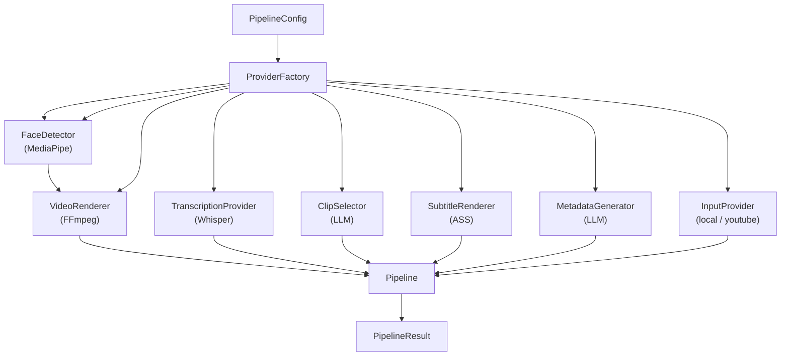

# Architecture

OpusClip is a modular, dependency-injected pipeline that transforms long-form
video into short-form clips with karaoke subtitles, smart cropping, and social
media metadata.

## High-Level Data Flow

```mermaid
flowchart LR
    Source["Video Source
    (file / YouTube URL)"]

    subgraph Input ["Input Layer"]
        LP["LocalFileProvider"]
        YP["YouTubeProvider"]
    end

    subgraph AI ["AI Layer"]
        WP["WhisperProvider
        (transcription)"]
        WR["word_repair"]
        LS["LLMClipSelector"]
        MM["LLMMetadataGenerator"]
    end

    subgraph Pipeline ["Pipeline Orchestrator"]
        Ctx["PipelineContext"]
        Mtr["PipelineMetrics"]
        Cache["CacheManager"]
    end

    subgraph Render ["Rendering Layer"]
        FD["MediaPipeFaceDetector"]
        SD["SmartDirector"]
        SR["ASSSubtitleRenderer"]
        VR["FFmpegOptimizedRenderer"]
        Val["Validator"]
    end

    subgraph Output ["Output"]
        Clips["Rendered clips (.mp4)"]
        Thumbs["Thumbnails (.jpg)"]
        Meta["Metadata (JSON)"]
        Summary["pipeline_summary.json"]
    end

    Source --> Input
    Input --> Pipeline
    Pipeline --> AI
    AI --> Pipeline
    Pipeline --> Render
    Render --> Output
```

## Pipeline Steps

The `Pipeline` orchestrator runs exactly 10 steps in sequence:

| # | Step | Description |
|---|------|-------------|
| 1 | Validate input | Verify source path/URL exists and is accessible. |
| 2 | Read metadata | Extract video dimensions, duration, FPS via ffprobe. |
| 3 | Transcribe audio | Extract audio, run Whisper, save transcript JSON. |
| 4 | Repair transcript | Fill missing word-level timestamps via interpolation. |
| 5 | Select clips | LLM identifies the most engaging segments. |
| 6 | Render subtitles | Build ASS subtitle files per clip. |
| 7 | Render videos | FFmpeg composes final clips (single-pass pipe). |
| 8 | Validate output | Verify resolution, codec, duration via ffprobe. |
| 9 | Generate metadata | LLM generates titles, descriptions, hashtags. |
| 10 | Produce outputs | Write summary JSON, organize files. |

## Dependency Injection

All providers are injected into `Pipeline` via `ProviderFactory`:

## State Management

- **`PipelineContext`**: Holds per-run state (video metadata, transcript,
  selected clips, output directory). Re-initialised for each `pipeline.run()`.
- **`CacheManager`**: Persists the highest completed step number per source
  to a JSON file, enabling `--resume` across interrupted runs.
- **`PipelineMetrics`**: Collects wall-clock timing per stage, per-clip render
  durations, API call/retry/failure counts. Resets per `pipeline.run()`.

## Provider Replaceability

Every AI component is behind an ABC. To replace a provider:

1. Implement the ABC (e.g. `class MyTranscriber(TranscriptionProvider)`).
2. Wire it in `ProviderFactory.create_*()` or pass it directly to `Pipeline`.

Current implementations:

| Interface | Default Implementation | Alternative |
|-----------|----------------------|-------------|
| `InputProvider` | `LocalFileProvider` / `YouTubeProvider` | Any source handler |
| `TranscriptionProvider` | `WhisperProvider` (faster-whisper) | Any ASR engine |
| `ClipSelector` | `LLMClipSelector` (OpenAI-compatible API) | Heuristic/keyword |
| `FaceDetector` | `MediaPipeFaceDetector` | OpenCV Haar cascades |
| `SubtitleRenderer` | `ASSSubtitleRenderer` | SRT/VTT generators |
| `VideoRenderer` | `FFmpegOptimizedRenderer` / `FFmpegLegacyRenderer` | Any video tool |
| `MetadataGenerator` | `LLMMetadataGenerator` (OpenAI-compatible API) | Template-based |
