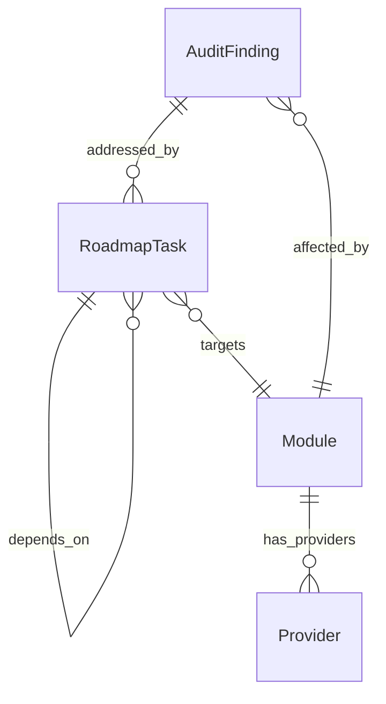

# Data Model: Production-Grade Engineering Audit & Refactoring

**Feature**: `001-production-audit-refactor`
**Date**: 2026-06-28

## Entities

### 1. AuditFinding

Represents a single issue discovered during the engineering audit.

| Field | Type | Required | Description |
|-------|------|----------|-------------|
| `id` | string | Yes | Unique identifier (e.g., `ARCH-001`, `CODE-012`, `SEC-003`) |
| `area` | enum | Yes | One of: `architecture`, `code`, `performance`, `ai_pipeline`, `dependencies`, `reliability`, `security`, `production_readiness` |
| `severity` | enum | Yes | One of: `Critical`, `High`, `Medium`, `Low` |
| `title` | string | Yes | Brief summary of the finding (≤80 chars) |
| `location` | string | Yes | Cell number and line range (e.g., `Cell 6, L562-632`) |
| `description` | string | Yes | Detailed explanation of the issue |
| `impact` | string | Yes | Concrete description of consequences if not addressed |
| `suggested_fix` | string | Yes | Actionable recommendation for remediation |
| `constitution_refs` | string[] | No | Which constitution principles this finding relates to |
| `related_findings` | string[] | No | IDs of related findings (for cross-referencing) |

**Severity Definitions**:
- **Critical**: Security vulnerability, data loss risk, or production blocker. Must be fixed before any deployment.
- **High**: Significant architectural or quality issue. Should be fixed in the first refactoring phase.
- **Medium**: Code quality or performance issue. Should be addressed but does not block progress.
- **Low**: Style, naming, or minor improvement. Can be deferred to polish phase.

**Identity/Uniqueness**: Each finding has a unique `id` composed of area prefix + sequential number.

---

### 2. Module

A self-contained component in the target modular architecture.

| Field | Type | Required | Description |
|-------|------|----------|-------------|
| `name` | string | Yes | Module name (e.g., `transcription`, `face_detection`) |
| `responsibility` | string | Yes | Single-responsibility description (what this module does and nothing else) |
| `public_interface` | Interface[] | Yes | List of public functions/classes the module exposes |
| `dependencies` | string[] | Yes | Other modules this module depends on (dependency direction) |
| `providers` | Provider[] | Yes | List of replaceable provider implementations |
| `current_location` | string | Yes | Where this logic currently lives in the notebook (cell/lines) |
| `migration_notes` | string | No | Notes on extracting this module from the monolith |

**Provider sub-entity**:

| Field | Type | Required | Description |
|-------|------|----------|-------------|
| `name` | string | Yes | Provider implementation name (e.g., `faster-whisper`, `MediaPipe`) |
| `is_current` | boolean | Yes | Whether this is the currently used provider |
| `license` | string | Yes | FOSS license identifier |
| `cost` | string | Yes | Must be `free` for all providers |
| `pros` | string[] | Yes | Advantages of this provider |
| `cons` | string[] | Yes | Disadvantages of this provider |
| `migration_complexity` | enum | Yes | One of: `Low`, `Medium`, `High` |

**Dependency Rules**:
- Dependencies flow inward: `output → rendering → subtitle/face_detection → transcription/clip_selection → input → core`
- No circular dependencies allowed
- Every module depends on `core` (config, caching) but `core` depends on nothing

---

### 3. RoadmapTask

A single improvement work item in the prioritized roadmap.

| Field | Type | Required | Description |
|-------|------|----------|-------------|
| `id` | string | Yes | Task identifier (e.g., `T-001`) |
| `priority` | enum | Yes | One of: `P1` (critical), `P2` (high), `P3` (medium), `P4` (low) |
| `title` | string | Yes | Brief task title (≤80 chars) |
| `description` | string | Yes | What the task accomplishes (≤200 words) |
| `expected_benefit` | string | Yes | Measurable improvement expected |
| `complexity` | enum | Yes | One of: `Low`, `Medium`, `High` |
| `risk` | enum | Yes | One of: `Low`, `Medium`, `High` |
| `depends_on` | string[] | No | IDs of tasks that must be completed first |
| `addresses_findings` | string[] | Yes | IDs of AuditFindings this task resolves |
| `constitution_compliance` | boolean | Yes | Whether this task passes constitution compliance check |
| `definition_of_done` | string | Yes | Clear, testable completion criteria |

**Lifecycle**:
```
Proposed → Approved → In Progress → Complete → Verified
```

**Sequencing Rules**:
- Tasks must be independently implementable (no implicit dependencies)
- Each task preserves backward compatibility
- P1 tasks must be completable without P2+ tasks
- No task may introduce a paid dependency

---

## Relationships



## Data Volume Estimates

| Entity | Expected Count | Notes |
|--------|---------------|-------|
| AuditFinding | 30–60 | Across 10 review areas, 8 notebook cells |
| Module | 8–10 | Core pipeline stages + orchestrator |
| Provider | 16–25 | 2–3 alternatives per AI-dependent module |
| RoadmapTask | 15–30 | Sequenced across 4 priority levels |
